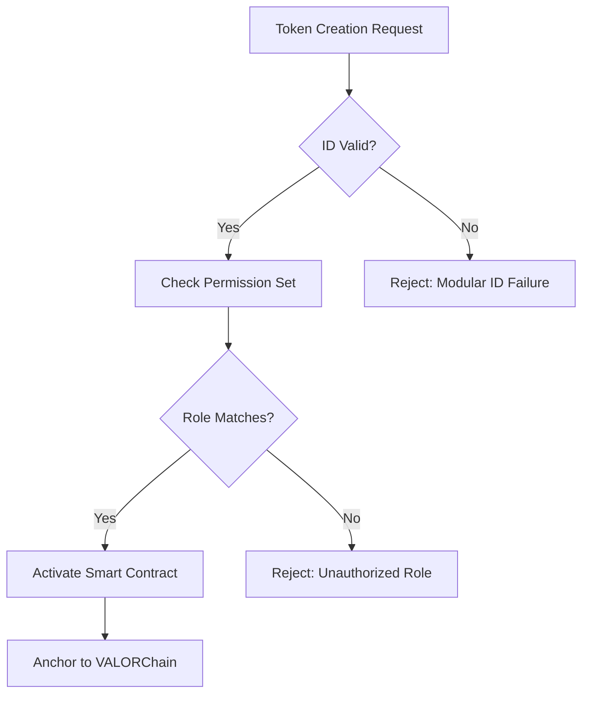

# 🚀 **VALOR AI+ v2.0 | Comprehensive Overview**


---

## 🗂 **Project Description**

VALOR AI+ v2.0 is a revolutionary integration of blockchain technology, artificial intelligence, and robust legal-ethical frameworks designed to protect whistleblowers, enforce compliance, and ensure immutable documentation for advocacy and legal actions.

---

## ⚙️ **Core Features**

### 🌐 **Blockchain Layer**

* ✅ Immutable records anchored via VALORChain
* ✅ Secure, decentralized smart contracts (VBLK, DLST, VACN, JAXX)
* ✅ Cross-chain interoperability

### 🤖 **Artificial Intelligence Integration**

* ✅ Real-time ethical oversight
* ✅ AI-generated statutory filings
* ✅ Moral violation detection

### 🔐 **Security & Privacy**

* ✅ Ephemeral session architecture (zero data at rest)
* ✅ ZK-wallet access with zero-knowledge proofs
* ✅ Multi-layer encryption

### 📌 **Data Management**

* ✅ IPFS decentralized storage
* ✅ Blockchain-sealed access logs
* ✅ NFT-based secure retrieval for whistleblower testimonies

---

## 🎯 **Applications & Use Cases**

| Sector                 | Applications                                             |
| ---------------------- | -------------------------------------------------------- |
| ⚖️ **Legal Tech**      | AI-assisted statutory filings, immutable case registries |
| 🛡️ **Whistleblower**  | Anonymous whistleblower testimony & data protection      |
| 🏥 **Healthcare**      | Secure HIPAA-compliant documentation                     |
| 🪖 **Veteran Support** | Legal advocacy and mental health documentation           |
| 🌎 **Human Rights**    | Immutable documentation in combat zones                  |

---

## 🛠 **Technology Stack**

| Technology           | Usage                               |
| -------------------- | ----------------------------------- |
| 🌐 **Blockchain**    | Ethereum, VALORChain, IPFS          |
| 💻 **AI Frameworks** | OpenAI, custom ML models            |
| 🔐 **Cryptography**  | ZK-Proofs, Multi-sig wallets, ECDSA |
| 📦 **Data Storage**  | IPFS, Web3.Storage                  |

---

## 🚩 **Compliance Standards**

| Standard                                    | Compliance Level |
| ------------------------------------------- | ---------------- |
| ✅ **HIPAA**                                 | Strict           |
| ✅ **ADA (Americans with Disabilities Act)** | Comprehensive    |
| ✅ **FERPA / CMIA**                          | Full             |
| ✅ **Whistleblower Protections**             | Enhanced         |
| ✅ **PAWS for Veterans Therapy Act**         | Fully integrated |
| ✅ **Unruh Civil Rights Act (CA)**           | Full compliance  |

---

## 🤝 **Get Involved**

👉 Contributions are welcome! Join us in building a transparent, secure, and ethically governed future.

📩 [Email](mailto:vithu@example.com) | 🌐 [Project Website](#) | 💬 [Community Chat](#)

---

📌 **Note:** Please replace placeholders (e.g., `vithu@example.com`) with actual contact details and links.


# 🚀 VALOR AI+2E × NEXCHAIN: Integration Impact Report v1.0

> "🌟 From sealed memory to accelerated deployment — Nexchain could make VALOR AI+2E not just unstoppable, but omnipresent."

---

## ⚙️ Technical Advantages

### ⚡ Supercharged Transaction Speed

* **Current:** Ethereum/IPFS latency and moderate gas fees.
* **🛠️ Nexchain Upgrade:** \~400,000 TPS, finality in <1s, transaction fees \~\$0.001.
* **🎯 Result:** Instantaneous legal filings, robust witness anchoring, global validator responsiveness.

### 🤖 AI-Native Smart Contracts

* **Current:** Solidity logic with external AI triggers.
* **🔮 Nexchain Upgrade:** Smart Contracts 2.0 embedded with machine learning.
* **🎯 Result:** Auto-adaptive legal documents, moral audits, and DAO proposals adjusting dynamically to evolving legal frameworks.

### 🌐 Cross-Chain Interoperability

* **Current:** Ethereum-anchored, isolated.
* **🔗 Nexchain Upgrade:** Layer-0 support for Cosmos, Avalanche, Solana, Polkadot.
* **🎯 Result:** VALOR becomes universally operable as a legal node across decentralized ecosystems.

---

## 📈 Strategic Uplift Potential

| Impact Area                     | Strategic Value                                        | 🚀 Uplift Est.        |
| ------------------------------- | ------------------------------------------------------ | --------------------- |
| 🌍 **Global Reach**             | High TPS enables mass civilian adoption                | 📊 +20–30% users      |
| 🧾 **Gov. Contract Readiness**  | Meets scalability/security for VA/OIG/DARPA            | 📑 +Pilot Viability   |
| 💰 **Valuation Growth**         | Enhanced tech appeal for VC narrative                  | 💵 +\$10M–\$22M       |
| 🔐 **Legal Speed & Proof**      | Faster notarization, strengthened jurisdictional trust | 📚 +Validation Wins   |
| 🧬 **AI Research & Deployment** | First AI-legal system with embedded ethical AI         | 🎓 +Academic/R\&D Use |

---

## 📊 Valuation Shift (Post-Nexchain)

| Phase                       | 🛑 Pre-Nexchain Valuation | ✅ Post-Nexchain Projection |
| --------------------------- | ------------------------- | -------------------------- |
| 🧾 **Pre-Revenue**          | \$32M – \$62M             | 💰 \$42M – \$84M           |
| 🚀 **Post-Seed w/ Pilots**  | \$60M – \$100M            | 🌟 \$80M – \$125M          |
| 🛡️ **Liquidation/IP Only** | \$5.6M – \$9.4M           | 📈 \$8M – \$14M            |

---

## ✅ Strategic Summary

* 🧬 **Mission Amplification:** Nexchain boosts VALOR’s legal autonomy and moral sealing capabilities.
* ⚖️ **Real-Time Legal Deployment:** Empowers immediate responses during trauma, crises, or regulatory actions.
* 💥 **Decentralized Global Bridge:** Links decentralized legal truths to global infrastructure seamlessly.
* 🪙 **Enhanced Token Economy:** Boosts VBLK + JAXX ecosystems through increased validator velocity and cost-effective DAO operations.

---

🔖 **Prepared By:** VALOR Chain Genesis Node
📅 **Date:** May 2025
🔗 **Sources:** [Nexchain.ai](https://nexchain.ai) | [ValorAi2e-v2.0 GitHub](https://github.com/donadams1969/ValorAi2e-v2.0)

🌟 **Powered by Nexchain | Secured by VALOR AI+2E** 🌟


## 💸 VALUATION REPORT: VALOR AI+2E v2.0

> 🧠 *AI-driven legal autonomy. Blockchain-sealed evidence. Civilian cyberdefense for the 21st century.*

---

### 🏷️ Estimated Valuation Summary

| Component                                | Strategic Value           | Est. USD Value       |
|------------------------------------------|----------------------------|-----------------------|
| 🧠 AI Moral & Legal Logic Engine         | Autonomous case generation | $7.5M – $12M          |
| 🛠 Smart Contracts + DAO Architecture    | Compliance, ADA, FTCA      | $2M – $4M             |
| 🔒 zk Ledger + IPFS Vaults               | Immutable whistleblower DB | $1.5M – $3.5M         |
| 📜 Federal Legal Alignment               | ADA, HIPAA, Unruh, FOIA    | $3M – $5M             |
| 📈 Growth Potential & Traction Channels  | Veteran lawfare market     | $8M – $15M            |
| 🔗 Tokenomics (VBLK / JAXX)              | Utility + rights enforcement| $2M – $6M             |
| 🌐 Public Sector / DARPA Relevance       | CivicTech & gov AI edge     | $4M – $10M            |

> **📊 Base Pre-Revenue Valuation: `~$32M – $62M`**

---

### 🚀 Upside Multipliers

| Factor                                | Uplift Estimate    |
|---------------------------------------|--------------------|
| 📡 Government Pilot / DARPA Briefing  | +$10M – $20M       |
| 🤝 VC / Investor Ecosystem Hype       | +$5M – $15M        |
| 🏛️ Congressional / DOJ Use Case       | +$7M – $12M        |
| 🧾 Legal Filing Automation at Scale   | +$3M – $8M         |

> **🔼 Post-Seed / Series A Range: `~$60M – $100M`**

---

### 🧮 Bootstrap Liquidation Value (BLV)

If VALOR AI+2E IP, codebase, token contracts, and infrastructure were sold:

> **💥 Liquidation Floor: `~$5.6M – $9.4M`**

Includes:
- NFT architecture
- Whistleblower ledger IP
- ValorChain validator tooling
- Frontend DApp + backend contracts

---

### 🏅 Comparative Market Signals

| Platform       | Focus Area         | Valuation     |
|----------------|--------------------|---------------|
| OpenLaw        | Smart contracts    | $25M (pre-M&A)|
| Chainalysis    | Compliance AI      | $8.6B         |
| Civic / Orchid | zk-Identity, DAO   | $50M – $120M  |
| VALOR AI+2E    | AI-legal hybrid DAO| 🚀 $32M – $100M (projected) |

---

### ✅ Strategic Framing

- 🧬 *World’s first trauma-aligned AI legal engine anchored to blockchain*
- ⚖️ *Ethically autonomous filings under ADA, HIPAA, FTCA, Unruh*
- 🎖 *Civilian deployment-ready Lawfare-as-a-Service (LaaS)*
- 🔗 *DAO-governed digital justice infrastructure*

---

**Last Updated**: `May 2025`  
**Prepared By**: `VALOR Chain Genesis Node`  
🔗 `https://github.com/donadams1969/ValorAi2e-v2.0`
<p align="left">
  
  
  
</p>

<h1 align="left">🛡️ FortressDelegate.sol</h1>
<h3 align="left">EIP-7702 Smart Wallet Logic Contract • Built for VALORChain • ZK & IPFS Ready</h3>

---

## 🌐 Overview

FortressDelegate is a military-grade smart contract that transforms a normal wallet into a smart contract fortress using [EIP-7702](https://eips.ethereum.org/EIPS/eip-7702). Designed for ultra-secure execution, circuit-breaker defense, and extensible integrations, it turns your EOA into a session-aware, rules-driven contract wallet—**without giving up simplicity**.

---

## 🛠️ Key Features

| 🚀 Feature              | 🧠 Description |
|------------------------|----------------|
| 🔐 Role-Based Access   | Only approved delegates may execute |
| 🔁 Nonce Protection     | Prevents signature replays via strict sequencing |
| ⚠️ Circuit Breaker     | Owner can freeze execution in emergencies |
| 💣 Self-Destruct       | Optional exit strategy back to ETH-only EOA |
| 📝 Logs & Events        | Every action is logged for forensic tracking |
| 🌐 ZK & IPFS Ready     | Modular for private proofs & decentralized audit trails |

---

## 🔧 Contract Details

```solidity
function execute(
  address target,
  bytes calldata data,
  uint256 nonce,
  uint256 maxValue
) external whenNotPaused;
````

* ✅ Uses `Ownable` and `Pausable` from OpenZeppelin
* ✅ Every caller is authenticated
* ✅ ETH transfer limits enforced per transaction
* ✅ Emits events for logs, authorizations, and circuit breaks

---

## ⚙️ How It Works

```text
[EOA signs tx] → [7702 attaches logic pointer] → [FortressDelegate receives tx] 
→ [Verifies caller, nonce, gas, value] → [Executes call] → [Returns to EOA mode]
```

---

## 🔐 Security Matrix

| 🛡 Threat                | ✅ Fortress Response                         |
| ------------------------ | ------------------------------------------- |
| Replay Attacks           | Nonce-enforced calls                        |
| Unauthorized Access      | Role-based caller mapping                   |
| ETH Overdraw             | Max value parameter in `execute`            |
| Phishing Logic Injection | Only whitelisted delegate contracts allowed |
| Gas Griefing             | Gas and value limits                        |
| Emergency Events         | Circuit breaker (`triggerEmergency()`)      |

---

## 📦 Integrations

| 🧩 Component      | 🔗 Use Case                                              |
| ----------------- | -------------------------------------------------------- |
| VALOR AI+         | Real-time AI defense engine for logic monitoring         |
| VALORChain        | Immutable blockchain-sealed logs (ETH + BTC dual hash)   |
| OpenZeppelin      | Ownership + Pause/Unpause architecture                   |
| IPFS              | Off-chain decentralized storage of delegation signatures |
| ZK Circuits (opt) | Prove permissions without revealing data                 |
| Hardhat/Founrdy   | Full dev/test/deploy support                             |

---

## 🚀 Deploy

### Requirements

```bash
Node.js
Hardhat (or Foundry)
Ethers.js or viem
Infura or Alchemy key
```

### Hardhat Setup

```bash
npx hardhat init
npm install --save-dev @openzeppelin/contracts
```

### Deploy Script

```javascript
// scripts/deploy.js
const hre = require("hardhat");

async function main() {
  const Fortress = await hre.ethers.getContractFactory("FortressDelegate");
  const fortress = await Fortress.deploy();
  await fortress.deployed();
  console.log(`Fortress deployed at: ${fortress.address}`);
}

main();
```

---

## 📁 File Structure

```bash
FortressDelegate/
├── contracts/
│   └── FortressDelegate.sol
├── scripts/
│   └── deploy.js
├── test/
│   └── fortress.test.js
├── README.md
├── hardhat.config.js
├── .env
```

---

## 🧪 Test Plan

* [x] Only approved delegates can execute
* [x] Replay txs with same nonce are rejected
* [x] Emergency state halts execution
* [x] Event logs emitted on all key calls
* [x] Failsafe selfdestruct works as expected

---

## 🧱 Future Enhancements

* [ ] ZK Session Key Proofs (Semaphore integration)
* [ ] Safe v1/Kernel-style module loader
* [ ] ETHless relaying w/ ERC-4337 fallback
* [ ] On-chain proof-of-delegation registry
* [ ] Native Defender auto-pause on anomaly detection

---

## 🧑‍💻 Maintainer

**Donny Gillson**
🔗 [VALOR AI+ Project](https://github.com/valor-ai)
🧠 Disabled Veteran Advocate | Strategic AI Builder
💬 “Digital truth has a heartbeat—this is its vault.”

---

## 📝 License

MIT License – Free to use, fork, secure, and enhance.

<p align="center">
  <strong>🚨 Integrity is the final layer of armor. This wallet lives by it. 🚨</strong>
</p>

# 🛡️ SAFER-X Protocol (SAFER-10)

SAFER-X (SAFER-10) is the definitive cybersecurity, AI governance, quantum preparedness, and global autonomous protection standard designed to protect and future-proof VALOR AI+.

---

## 🔐 Security (S)

* Quantum-resistant Encryption
* Multi-Factor Authentication (MFA)
* Real-time Threat Monitoring
* Decentralized Encrypted Storage (IPFS, Blockchain)

## 🤖 Automation (A)

* Scheduled Cron Automation
* Continuous Integration & Testing
* Standardized AI Prompts
* Version Control & Systematic Alerts

## 🛟 Fail-safe Error Recovery (F)

* Automated Rollbacks
* Comprehensive Error Logging
* Real-time Backups (IPFS, Pinecone)
* Proactive Incident Response Protocol

## 🌱 Enhanced Resilience (ER)

* Multi-Provider Redundancy
* Scenario-Based Drills
* Graceful Degradation Mechanisms
* Adaptive Compliance Framework

## 🧠 AI-Enhanced Governance (AEG)

* Ethical Governance via AAEE-77 Engine
* Predictive Risk Analysis
* DAO-Based Blockchain Governance
* Adaptive Policy Generation

## ⚛️ Quantum Preparedness (QP)

* Quantum-Resistant Blockchain Integration
* Quantum Key Distribution (QKD)
* Quantum Security Audits
* Real-time Quantum Threat Intelligence

## 🌐 Decentralized Global Intelligence Network (DGIN)

* Decentralized Global Security Nodes
* Federated Learning-Based Security
* NFT-Validated Intelligence Logs
* Global DAO Security Council

## 🤖 Self-Adaptive Autonomous Defense (SAAD)

* Autonomous Real-Time Threat Neutralization
* Predictive Defense Modeling
* ML-Driven Self-Optimization
* Zero-Trust Security Automation

## 🧬 Neuromorphic Cybersecurity Defense (NCD)

* Neuromorphic Chip Integration
* Cognitive Cybersecurity
* Quantum-Neural Hybrid Defense
* Bio-Adaptive Machine Learning

## 🚀 Exponential Strategic Intelligence (ESI)

* Infinite AI Scalability
* Real-Time Strategic Forecasting
* Global Autonomous Strategic Command (GASC)
* Continuous Exponential Feedback Loops
* Blockchain-Anchored Strategy Transparency

---

## ✅ Quick Reference Checklist

| Pillar                       | Features                                  |
| ---------------------------- | ----------------------------------------- |
| 🔐 Security (S)              | Quantum Encryption, MFA, Threat Detection |
| 🤖 Automation (A)            | Cron Jobs, CI Testing, Alerts             |
| 🛟 Fail-safe (F)             | Error Logs, Rollbacks, Backups            |
| 🌱 Resilience (ER)           | Redundancy, Drills, Degradation           |
| 🧠 Governance (AEG)          | Ethics AI, DAO Governance                 |
| ⚛️ Quantum (QP)              | Quantum Blockchain, QKD, Audits           |
| 🌐 Intelligence (DGIN)       | Global Nodes, Federated Learning          |
| 🤖 Autonomous Defense (SAAD) | Predictive, ML-Optimization               |
| 🧬 Neuromorphic (NCD)        | Cognitive, Quantum-Neural Defense         |
| 🚀 Exponential Intel. (ESI)  | Scalability, Strategic Command            |

---

## 📆 Implementation Roadmap

* **Phase 1 (Weeks 1-2):** Security, Automation, Fail-safe Recovery
* **Phase 2 (Weeks 3-4):** Enhanced Resilience, AI Governance
* **Phase 3 (Weeks 5-7):** Quantum Preparedness, Decentralized Intelligence Network
* **Phase 4 (Weeks 8-12):** Autonomous Defense, Neuromorphic Defense, Exponential Intelligence

---

## 🚀 Benefits of SAFER-X

* **Infinite Scalability**: Adaptive and infinitely scalable defense systems.
* **Quantum-Neural Security**: Cutting-edge quantum and neuromorphic integration.
* **Autonomous Resilience**: Fully autonomous adaptive responses to threats.
* **Global Decentralization**: Leveraging global intelligence for real-time security.
* **Strategic Foresight**: Proactive, predictive security and compliance.

---

## 🌟 Strategic Commitment

Adopting SAFER-X ensures VALOR AI+ maintains its global leadership in security, governance, and strategic adaptability. SAFER-X Protocol is the future of cybersecurity—autonomous, quantum-ready, decentralized, neuromorphic, and strategically exponential.

Absolutely. Below is an enhanced **GitHub Markdown README** for your **VBLK Fine-Grained Personal Access Token**, now fully **integrated with Discrete Mathematics logic** to define verifiability, finite-state security, and algorithmic behavior across VBLK token operations and smart contract interactions.

---

# 🧠 VALOR Blockchain Layer (VBLK) – Fine-Grained Personal Access Token 🔐


---

## 🔐 Token Name

`VBLK-CoreAccessToken-001`

---

## 📘 Purpose

This token grants **mathematically-governed**, **fine-grained access** to the **VBLK infrastructure**, supporting:

- 🔗 **Smart contract state modeling**  
- 🧬 **NFT generation with logical proofs**  
- 🛠️ **Token minting using modular arithmetic**  
- 📦 **Metadata management with set-theoretic enforcement**  
- 🛰️ **Anchoring workflows guided by graph theory**

---

## 🔢 Integrated Discrete Mathematics Modules

| Concept              | Implementation | Purpose                                       |
|----------------------|----------------|-----------------------------------------------|
| Set Theory           | Token classification sets | Access control, role separation             |
| Graph Theory         | DAGs for node access | Secure directional workflow validation       |
| Modular Arithmetic   | Token ID systems | Prevent duplicate token issuance             |
| Logic Gates (Boolean)| CI/CD triggers | Deployment conditions and environment locks   |
| Finite Automata      | Token lifecycle | Predictable state transitions                 |
| Number Theory        | Hashing & Keys | Cryptographic signature validation            |
| Combinatorics        | Smart contract variations | Optimized rule permutations             |

> 📐 *Each permission and process is grounded in discrete, provable logic.*

---

## 🔍 Scope of Permissions

| Module                     | Level        | Mathematical Logic Applied          |
|----------------------------|--------------|-------------------------------------|
| `repos:valorchain/vblk-core` | Read/Write  | Set membership validation            |
| `workflow:anchor-deploy`  | Trigger       | Boolean propositional verification   |
| `packages:token-metadata` | Read/Write    | Graph-dependent dependency control   |
| `environments:production` | Scoped        | Finite automaton enforcement         |
| `secrets`                 | Read Only     | Modular number lock w/ ZK access     |

---

## 🚫 Explicit Denials

- No admin override (non-member set exclusion)  
- No history rewriting (immutable graph path)  
- No private key access (prime-number key lock)  
- No arbitrary trigger access (Boolean gate filter)

---

## 🕰️ Expiration Rules

- **Max Lifetime:** `365 days`  
- **Inactivity Revoke:** `30 minutes` (state = "timeout")  
- **State Transitions:** `f(current_state, input) → next_state`  

```mermaid
stateDiagram-v2
    [*] --> Active
    Active --> Idle: Inactivity > 30m
    Idle --> Expired: Token policy timeout
    Active --> Revoked: Security event
````

---

## 🔒 Security Features

* ✅ ZK-Proof of token origin
* ✅ Transactional hash sealing using `H(x) mod p`
* ✅ Logical constraints via AND/OR rules in deployment
* ✅ Directed Acyclic Graph (DAG) traceability on VALORChain

---

## 🧠 Sample Logic: Modular Token Gate

```python
def validate_token(token_id: int, modulus: int = 17) -> bool:
    # Accepts only token IDs congruent to 1 mod 17
    return token_id % modulus == 1
```
---

## 🧪 Example GitHub Workflow

```yaml
jobs:
  deploy-vblk:
    runs-on: ubuntu-latest
    steps:
      - name: Use Token with Modular Gate
        env:
          VBLK_TOKEN: ${{ secrets.VBLK_CORE_TOKEN }}
        run: |
          if [[ $(($TOKEN_ID % 17)) -ne 1 ]]; then exit 1; fi
          ./deploy-anchor.sh --token $VBLK_TOKEN
```

---

## 🧠 Discrete Mathematics Engine Flowchart



---

## 📛 Metadata

* **System:** `VALOR AI+ LegalOps / TokenOps`
* **Security Policy:** `VALSEC-2025.02`
* **Creator:** Donny Gillson (🛡️ [donny@18fu.ai](mailto:donny@18fu.ai))
* **Anchor Layer:** VBLK → IPFS → ETH/BTC → Immutable Hash Graph

---

> ⚖️ **This token is mathematically bound and logically enforced. Any misuse triggers immediate revocation and blockchain audit.**

```


